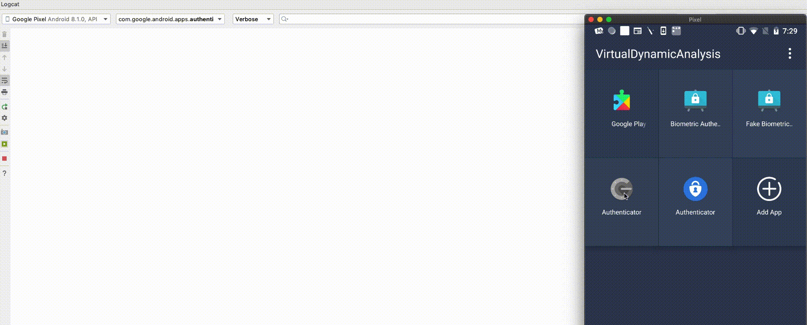
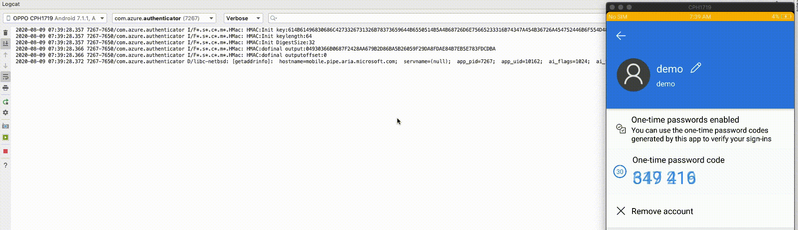
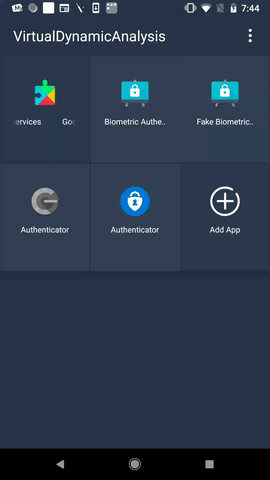
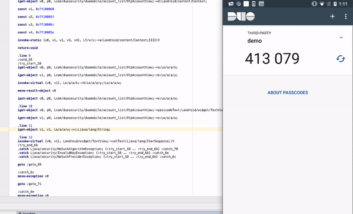

# VirtualDynamicAnalysis
PoC app to demonstrate how to perform dynamic analysis on apps installed inside a cloning app without root or repackaging the application. This app is based on [VirtualApp](https://github.com/asLody/VirtualApp)

# License and Warning
Since this app is derived from Virtual app. Please refer to VirtualApp's [declaration](https://github.com/asLody/VirtualApp).

# Demo

## Attacking Popular apps with fake security provider

### Google Authenticator
Google Authenticator depends on the default Security Provider. By executing it inside the cloning app OTP seed used in HMAC operation can be fetched from the logcat

### Microsoft Authenticator
The same case with Microsoft Authenticator

## Attacking Android Keystore
This is to demonstrate how a Fake Biometric Authentication App installed alongside a benign Biometric Authentication app inside cloning app can make use of the AES Key generated inside Android Keystore to decrypt a secret message

## Debugging a playstore application
This is to demonstrate any guest app can be made debuggable if the host app is debuggable

# Blog

For more details please visit my 
[blog Part 1](https://darvincitech.wordpress.com/2020/07/18/all-your-crypto-keys-belongs-to-me-in-android-virtual-containers)
[blog Part 2](https://darvincitech.wordpress.com/2020/10/11/virtual-dynamic-analysis-part-2)

